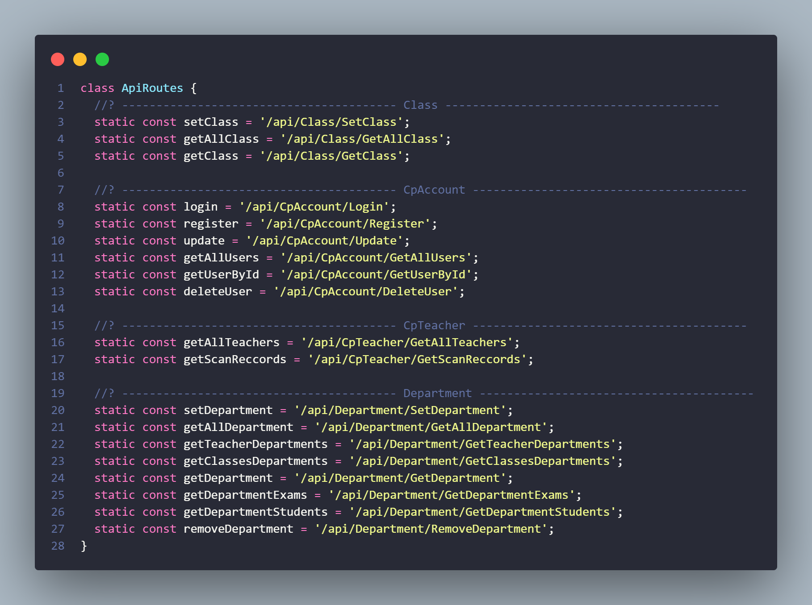

# Swagger Dart Router VS Code Extension

The **Swagger Dart Router** VS Code extension simplifies the process of generating Dart routes directly from a Swagger file. With just a few clicks, you can convert your Swagger API documentation into a Dart file containing all the necessary routes, organized by scope. This extension is perfect for Dart developers who want to streamline their API integration workflow and avoid manually typing out each route.

## Features

1. **Automatic Route Generation**: Automatically generates Dart routes based on the paths and methods defined in the Swagger file, reducing manual effort and potential errors.
2. **Customizable Output**: Specify the output file name and location, allowing flexibility in integrating the generated routes into your Dart projects.
3. **Scope-based Organization**: Routes are grouped by scope, making it easier to navigate and manage them within the generated Dart file.
4. **CamelCase Naming**: Path segments are converted to camelCase for better readability and adherence to Dart naming conventions.
5. **Error Handling**: Handles errors gracefully, providing informative messages in case of failures during Swagger file retrieval or route generation.
6. **Generated File Comments**: Includes comments indicating that the Dart file is auto-generated, helping developers understand its purpose and avoid accidental modifications.
7. **Dependency Management**: Relies on the `http` package for making HTTP requests and `dart:io` for file operations, ensuring compatibility with Dart projects and simplifying dependency management.
8. **CLI Compatibility**: Easily integrates into continuous integration (CI) pipelines or build scripts as a command-line tool, enhancing automation capabilities.
9. **Community Support**: Being open-source, it benefits from community contributions and feedback, ensuring continuous improvement and adaptation to evolving needs.
10. **Cross-platform Compatibility**: Dart is a versatile language, and the generated routes can be used in various Dart environments, including Flutter apps, web applications, and server-side Dart projects.

## Installation

1. Open the Extensions view in VS Code (Ctrl+Shift+X or Cmd+Shift+X).
2. Search for **Swagger Dart Router**.
3. Click **Install**.

## Requirements

- An active internet connection to fetch the Swagger Json data.
- Valid Swagger Json URL.

## Usage

1. Open the command palette (Ctrl+Shift+P or Cmd+Shift+P).
2. Type and select **Generate Dart Routes from Swagger**.
3. Enter the Swagger Json URL when prompted.
4. Choose the location to save the generated Dart file.
5. The extension will generate a Dart file with routes organized by scope.

## Known Issues

List any known issues here to help limit duplicate reports. (e.g., "Currently does not support Swagger files with..." or "Known issue with paths containing special characters...")

## Contributing

We welcome contributions to improve this extension! Feel free to submit issues and pull requests to the [GitHub repository](https://github.com/Abdo-ka/Swagger-to-dart-route.git).

## Support

If you encounter any issues or have any questions, please reach out via the [GitHub issues page](https://github.com/Abdo-ka/Swagger-to-dart-route.git/issues).

## Screenshots

  

---

**Enjoy!**
